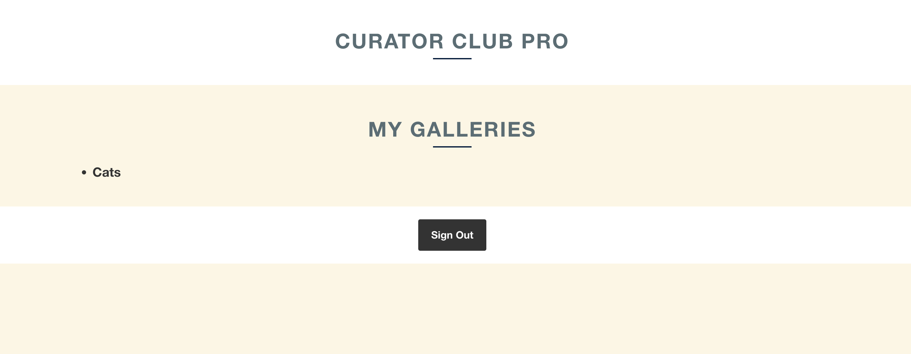

# Curator Club Pro

Curator Club Pro” is a a space for artists and curators to create their own virtual art gallery using data from the MET Museum of Art. This is a space for beginners to experts to explore their interests in visual art to find inspiration, curate their own favorite pieces, and learn about art. Many iconic painting and illustrations are located in international museums that cannot be seen without making a whole trip. Here anyone can see their favorite artwork!

Curator Club Pro is a web application that allows users to create their own virtual art gallery. Users can search for artowrks by name or artist and they can also curate their own collection of artworks. users can also create accounts and and log in to save their favorite Artworks.

## Getting Started

 

To checkout the app, simly visit the [deployed website.](https://monumental-longma-39f559.netlify.app/)

You can also view the project's planning board on [Trello.](https://trello.com/invite/b/yXJ0ojoB/ATTI68dedbaf1512ab98967d8168f82d935eB9B17A55/capstone-project)

### Site Deployment Pictures:

### Technologies

- React
- Node.js
- MongoDB
- Mongoose
- MET API
- Hosted on Nelify and Heroku
- Communicating with Express via AJAX
- PostMan for testing API issues

### MVP User Stories

- As a user, I want to search artworks by their name or artist so that I can find the art I am interested in.
- As a user I want to curate my own collection of art so I can share it with others.
- As a user I want to create an account and log in so I can save my favorite art
- As a user I want to view artworks from the MET museum of Art

### IceBox Items

- As an admin I want to add descriptions to artworks so users can understand them better
- As a user, I want to be able to browse art my artist, era, art movement and region.
- As a user I want to be able to post my art questions to the community so they can interact.
- As a user I want to find local art classes and communities to meet fellow artists.

## API

I went with the Metropolitan Museum of Art API as it gave users the most freedom to interact with their database ofartwork. I had plans to incorporate Europeana's European Museum Artwork Catalog but could not secure permissions on time.

- **Metropolitan Museum of Art API:**This API has data on over 400,000 pieces of art with a span of over 5,000 years, Images, artist name and artwork title are included exceppt on historical peices where additional data could not be found. The Metropolitan Museum of Art has waived all copyright and related or neighboring rights to this dataset using the [Creative Commons Zero](https://creativecommons.org/publicdomain/zero/1.0/) license. You can read more about this API on their [site](https://metmuseum.github.io/).

## Next Steps

*Add "Favorites" funcitonality to the artworks that users search up, each "favorite" will populate on a separate page so users can keep track of their favorite artworks
*Correct the Sign Up/Sign In page so users can create accounts to save their galleries and artworks
*Scrap the original "Create a Gallery" functionality where a user just writes a post but correct it so when a user creates a Gallery, they first write the name of the gallery, any notes they want to add, and then searchand add artworks they want to add to the gallery before saving the form
*Implement forum functionality so users can interact with each other.

## What I learned from this project

This project was going smoothly until I started torealize that I approached the building of this project in a way which made things really difficult  for me in the end. I did all of the back end first and then the front end. I think I should have adopted an approach where I work in backend for a bit and then in the frontend so I can test my functionality peice by piece instead of all at the same time. There wasa lot of mistakes I also made with my routing.

I had a lot of issues with deployment, for some reason I could not log into my Netlify account at all so I made a whole new accout in order to keep on troubleshooting and get it deployed. I think moving forward I lered that I need to take advantage of version control, deploy early and test often, incorporate error handling and logging, pay attention to performance optimization and overal imporve my code quality and best practices.

## Acknowlegements and Links that helping me troubleshoot my project

* Instructional Team at Adobe Digital Academy
* Stack Overflow.
* https://www.w3schools.com/
* [Styling](https://www.w3schools.com/w3css/w3css_templates.asp)
* [Images for Main Page](https://www.metmuseum.org/art/collection/search?searchField=All&showOnly=openAccess&sortBy=relevance&pageSize=0&q=monet)
* ["nth Check" trouble shooting](https://stackoverflow.com/questions/71282206/github-dependabot-alert-inefficient-regular-expression-complexity-in-nth-check)
*[react-sripts not found Help ](https://itsjavascript.com/react-scripts-command-not-found#:~:text=The%20react%2Dscripts%3A%20command%20not%20found%20error%20mainly%20occurs%20if,node_modules%20folder%20and%20package%2Dlock.)
